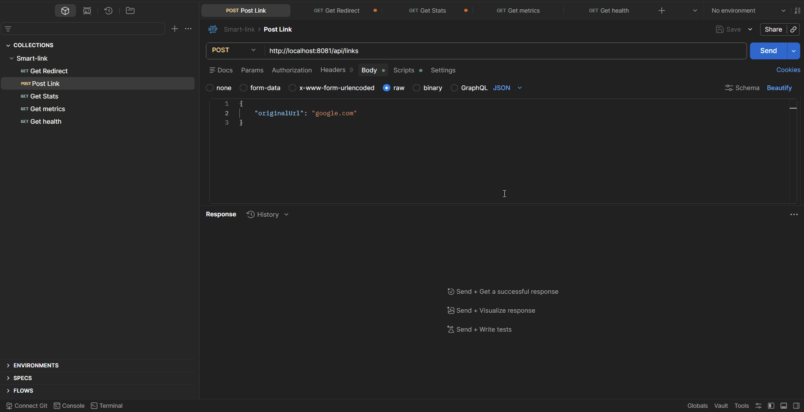
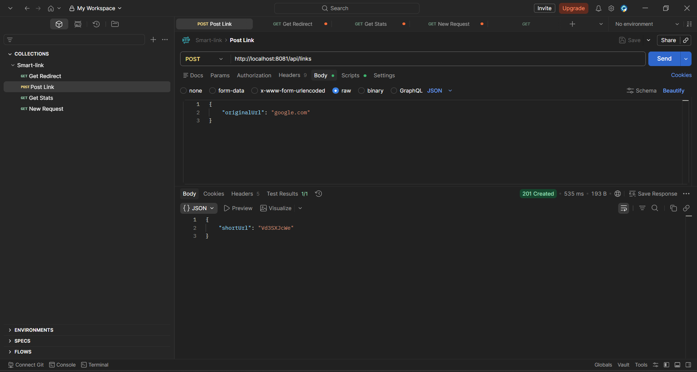
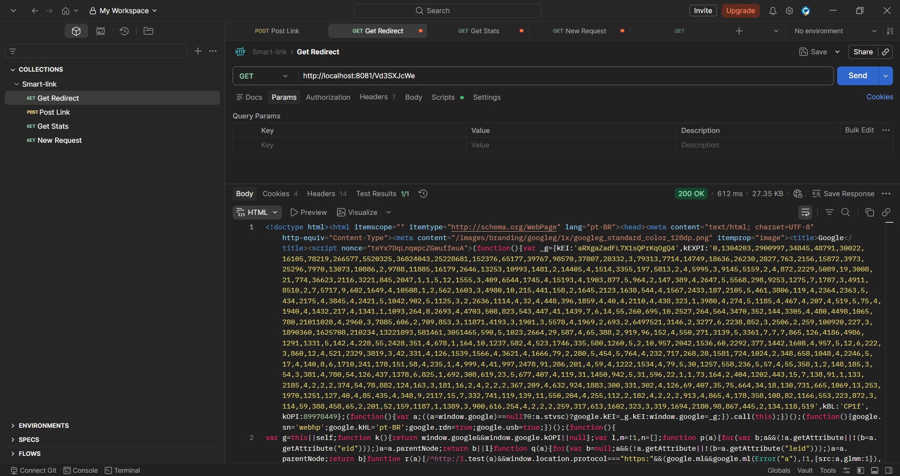
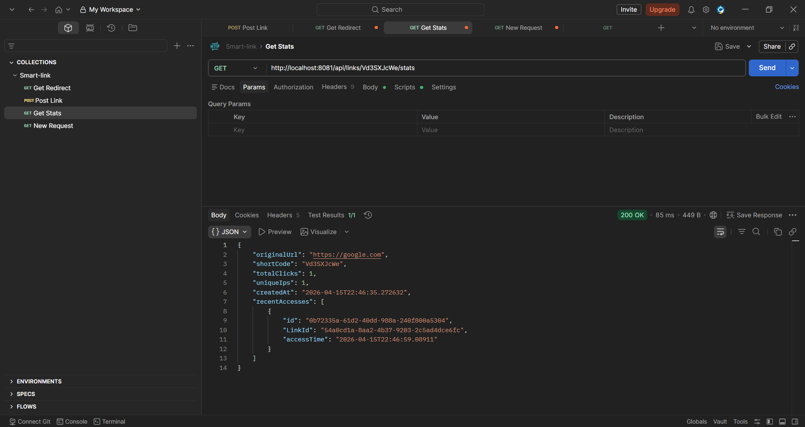

# 🔗 Smart Link Platform

Encurtador de URLs com rastreamento de acessos e processamento assíncrono utilizando RabbitMQ.

---

## Visão geral 

O Smart Link Platform é uma API backend desenvolvida em Java com Spring Boot que permite:

- Encurtar URLs
- Redirecionar links
- Rastrear acessos (cliques, IPs, histórico)
- Processar eventos de forma assíncrona com mensageria

O projeto foi desenvolvido com foco em boas práticas de mercado, incluindo arquitetura em camadas, testes automatizados e containerização com Docker.

--- 

## Arquitetura

A aplicação segue uma arquitetura baseada em:

- Controller → exposição de endpoints REST
- Service → regras de negócio
- Repository → acesso a dados (JPA)
- Messaging (RabbitMQ) → processamento assíncrono de eventos de clique

Fluxo simplificado:

1. Usuário acessa um link encurtado
2. API redireciona para a URL original
3. Evento de acesso é enviado para o RabbitMQ
4. Consumer processa e salva os dados de analytics no banco

---

## Tecnologias

- Java 21
- Spring Boot
- Spring Data JPA
- PostgreSQL
- RabbitMQ
- Docker & Docker Compose
- Swagger (OpenAPI)
- JUnit & MockMvc

---

## Como Executar com Docker 

### Pré-requisitos 
- **Docker**
- **Docker Compose**

--- 

## Subir toda a aplicação

``` 
mvn clean package -DskipTests  

docker compose up --build
```
---

## Serviços disponíveis 

1. **API**: http://localhost:8081
2. **Swagger**: http://localhost:8081/swagger-ui/index.html
3. **RabbitMQ UI**: http://localhost:15672

--- 

## RabbitMQ Login: 

**user**: guest  
**password**: guest

--- 

## Endpoints

### Criar link 

POST /api/links

Request:

```
{
"originalUrl": "http://google.com"
} 
``` 

Response:

``` 
{
"shortUrl": "abc123"
}
``` 

--- 

### Redirecionar link

GET /{shortCode}

Response:

- HTTP 302 (Redirect)

--- 

### Estatísticas do link
GET /api/links/{shortCode}/stats

Response:
```
{
"originalUrl": "...",
"shortCode": "...",
"totalClicks": 10,
"uniqueIps": 5,
"createdAt": "...",
"recentAccesses": []
}
``` 

---

## Tratamento de erros


| Erro | Situação            | 
|-----:|:--------------------|
|  404 | Link não encontrado |
|  410 | Link expirado       |
|  403 | Link inativo        |

--- 

## Testes

O projeto possui testes automatizados utilizando:

- JUnit
- MockMvc

Os testes são executados com banco em memória (H2), garantindo isolamento e independência da infraestrutura.

```bash
mvn test
```

--- 

## Observabilidade

### Endpoints disponíveis via Spring Actuator:

**/actuator/health**

**/actuator/metrics** 


--- 
## Melhorias Futuras 

- Autenticação e autorização (Spring Security)
- Rate limiting
- Cache com Redis
- Deploy em cloud (AWS)
- Testcontainers para testes com infraestrutura real
---

## 🎬 Demonstração



--- 

## Funcionalidades

### 🔗 Criação de link


---

### 🔁 Redirecionamento


---

### 📊 Aumento de métricas


--- 
## Autor

Desenvolvido por **Marcelo Melo**.

--- 

## Licença

Este projeto é para fins de estudo e portfólio.
